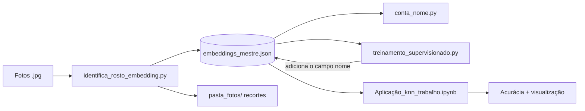

# Reconhecimento Facial com KNN

> ⚠️ **PROTÓTIPO — FASE DE ESTUDO**
> Projeto experimental para estudar reconhecimento facial supervisionado. Não é código de produção.

A ideia é reproduzir, em pequena escala, o que o **Google Fotos** faz: detectar os rostos das fotos, você dá nome a cada um e o modelo aprende a reconhecer essas pessoas em rostos novos.

---

## Como funciona



| Etapa | Arquivo | O que faz |
|:---:|---|---|
| 1 | `identifica_rosto_embedding.py` | Detecta rostos, filtra os ruins e gera os embeddings |
| 2 | `conta_nome.py` | Conta quantos rostos existem por nome (conferência) |
| 3 | `treinamento_supervisionado.py` | Mostra cada rosto e pede o nome (rotulagem manual) |
| 4 | `Aplicação_knn_trabalho.ipynb` | Treina o KNN, testa e mostra os acertos e erros |

---

## Estrutura do projeto

```
treinamento_facial/
├── identifica_rosto_embedding.py    # 1. extração de rostos e embeddings
├── conta_nome.py                    # 2. contagem de rostos por nome
├── treinamento_supervisionado.py    # 3. rotulagem manual
├── Aplicação_knn_trabalho.ipynb     # 4. treino e avaliação do KNN
├── README.md
│
├── embeddings_mestre.json           # gerado localmente (no .gitignore)
└── pasta_fotos/                     # recortes dos rostos (no .gitignore)
```

> O `embeddings_mestre.json` e a `pasta_fotos/` **não vão para o repositório**, porque contêm dados pessoais (rostos). Eles são gerados na sua máquina ao rodar o passo 1.

---

## Guia de como usar

### 1 - Extrair os rostos — `identifica_rosto_embedding.py`

Percorre a pasta de fotos (incluindo subpastas), procura arquivos `.jpg` e, para cada foto:

- **Detecta** os rostos com **RetinaFace**
- **Gera o embedding** de cada rosto com **Facenet** (vetor de 128 números que representa o rosto)
- **Descarta rostos ruins** que falhem em algum filtro:

  | Filtro | Critério |
  |---|---|
  | Confiança da detecção | mínimo de 0,95 |
  | Tamanho do rosto | mínimo de 80 × 80 px |
  | Nitidez (variância do Laplaciano) | mínimo de 50 |

- **Salva o recorte** do rosto (com margem de 50 px) em `pasta_fotos/`
- **Grava tudo** em `embeddings_mestre.json`

Cada registro do JSON fica assim:

```json
{
    "foto_original": "caminho/da/foto.jpg",
    "caminho_recorte": "pasta_fotos/.../rosto_1.jpg",
    "embedding": [0.12, -0.53, "..."]
}
```

```bash
python identifica_rosto_embedding.py
```

### 2 - Conferir os dados — `conta_nome.py`

Lê o JSON e mostra quantos rostos existem por nome. Pode ser executado em dois momentos:

- **Depois do passo 1:** todos os rostos ainda aparecem como `Desconhecido`, então o total indica quantos rostos foram detectados.
- **Depois do passo 3:** mostra a distribuição por pessoa, permitindo checar se estão equilibradas, quantos rostos ficaram como `Desconhecido` e se há nomes digitados errado.

```bash
python conta_nome.py
```

Exemplo de saída (após o passo 3):

```
Aparições por pessoa:
Desconhecido: 120
dante: 45
eu: 38
```

### 3 - Dar nomes aos rostos — `treinamento_supervisionado.py`

Assistente de rotulagem no terminal. Cada recorte aparece em uma janela e você digita o nome da pessoa, como acontece ao nomear rostos no Google Fotos.

| Você digita | O que acontece |
|---|---|
| Um nome | O rosto recebe esse nome |
| `pular` ou Enter vazio | O rosto vira `Desconhecido` |
| `sair` | Para, salva o progresso e fecha |

Rostos que já têm nome são ignorados, então dá para rotular aos poucos e continuar depois.

```bash
python treinamento_supervisionado.py
```

### 4 - Treinar e testar — `Aplicação_knn_trabalho.ipynb`

O notebook tem três blocos:

1. **KNN do zero:** classe `KNN_do_Zero`, implementada sem scikit-learn (distância euclidiana, voto dos *k* vizinhos mais próximos).
2. **Treino e teste:** carrega o JSON rotulado, normaliza os embeddings, separa 80% para treino e 20% para teste e imprime a acurácia (k = 3).
3. **Visualização:** mostra os rostos do conjunto de teste com o nome real e o previsto. O título fica verde quando acerta e vermelho quando erra.

---

## Conceitos usados

- **Embedding:** vetor numérico que representa um rosto. Rostos da mesma pessoa ficam com vetores parecidos.
- **Normalização L2:** deixa todos os vetores com comprimento 1, para que a comparação dependa só da direção e não de iluminação ou nitidez da foto.
- **KNN (K-Nearest Neighbors):** classifica um rosto novo pelo voto dos *k* rostos conhecidos mais parecidos.
- **Aprendizado supervisionado:** o modelo aprende a partir de exemplos com nome, por isso a etapa de rotulagem manual.

---

## Limitações conhecidas

- **Rostos borrados** geram embeddings ruidosos e são a principal fonte de erros.
- **"Desconhecido"** entra no KNN como se fosse uma pessoa, o que distorce o treino. Reconhecer "alguém que não conheço" de verdade exige rejeição por distância.
- **Divisão treino/teste aleatória por rosto:** rostos da mesma foto podem cair nos dois lados, o que infla a acurácia.

---

## Próximos passos

- [ ] Separar `Desconhecido` (pessoa real não identificada) de `descartar` (rosto ruim)
- [ ] Rejeitar rostos distantes demais em vez de treinar com "Desconhecido"
- [ ] Dividir treino e teste por foto, e não por rosto
- [ ] Usar validação cruzada para uma acurácia mais confiável
- [ ] Testar um modelo de embedding maior (ex.: Facenet512 ou ArcFace)
- [ ] Ajustar o limite de nitidez para descartar mais rostos borrados

---

## Privacidade

Este projeto lida com fotos e rostos de pessoas reais. Por isso, as fotos originais, os recortes e os embeddings ficam fora do Git e não devem ser compartilhados sem autorização de quem aparece nas imagens.